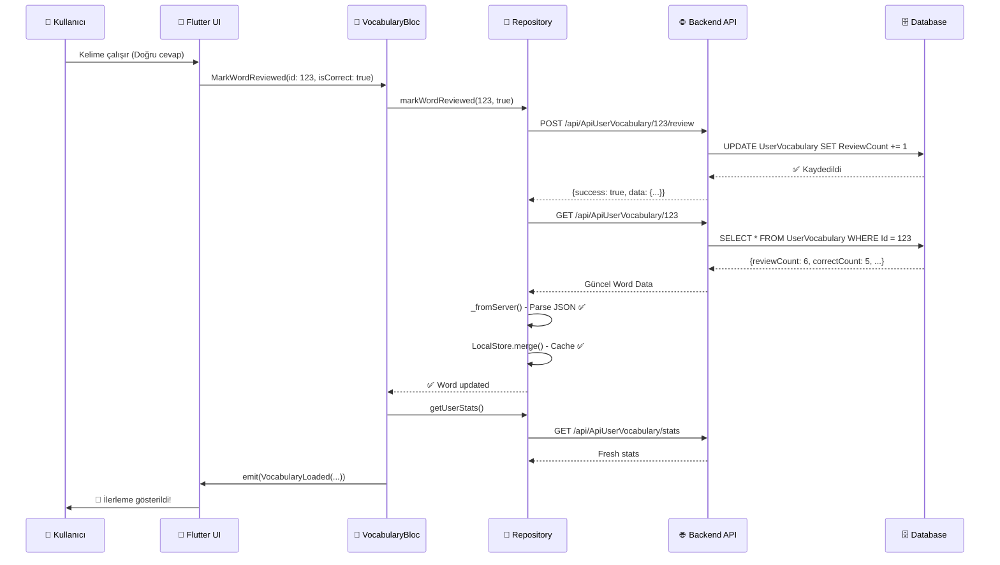
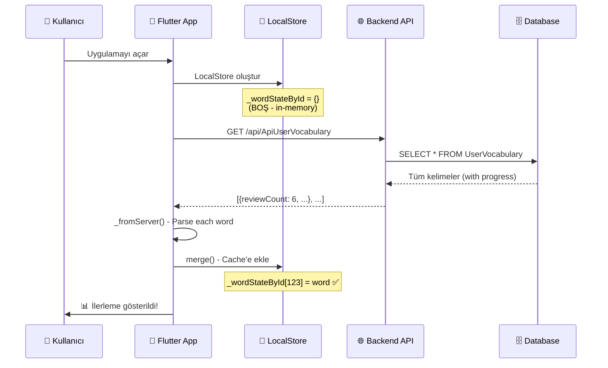
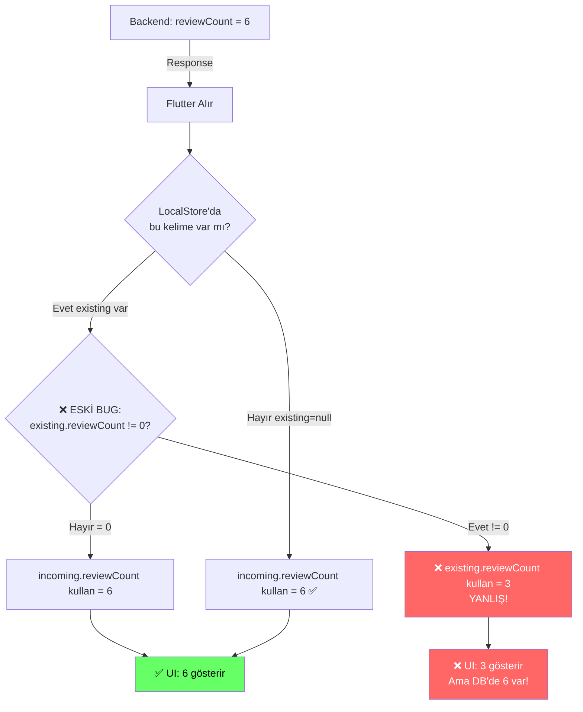
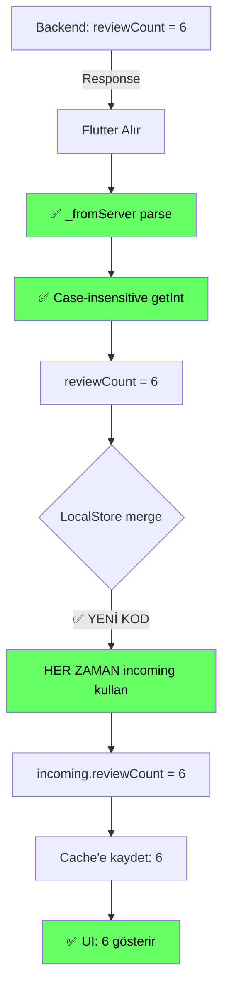
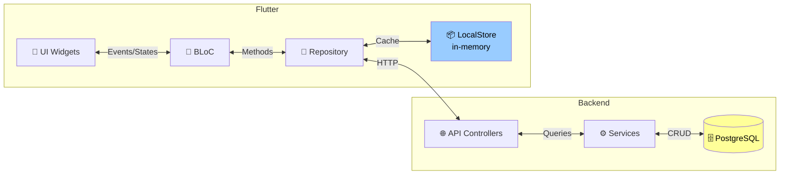
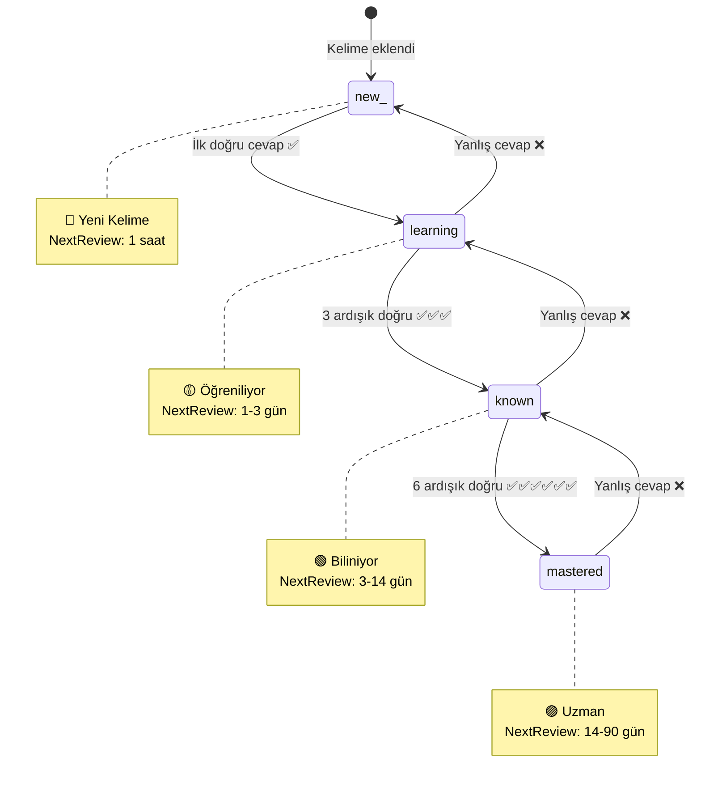
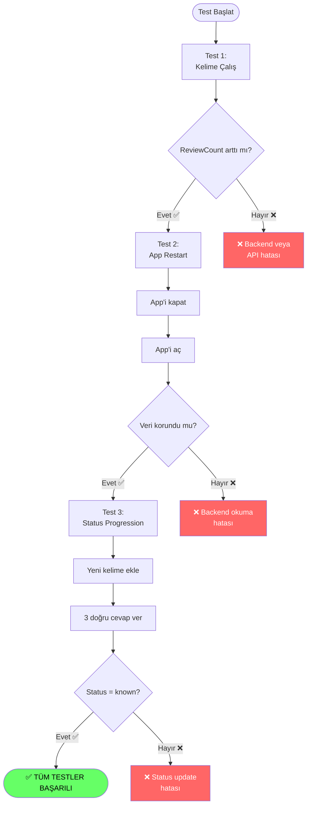
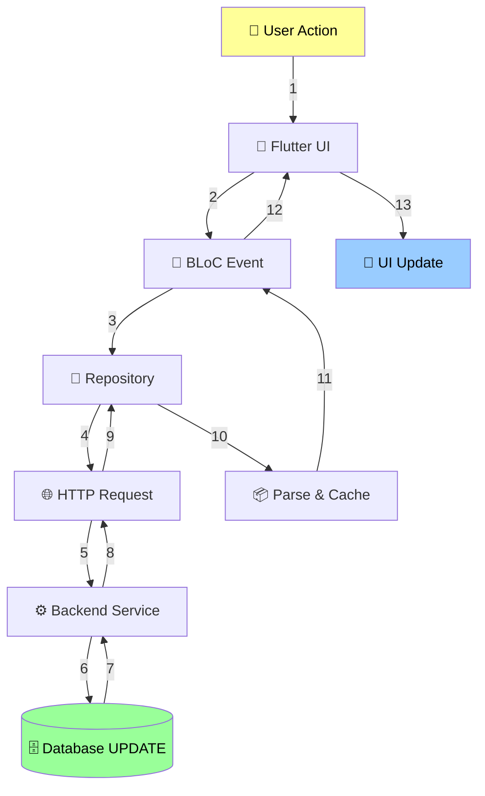
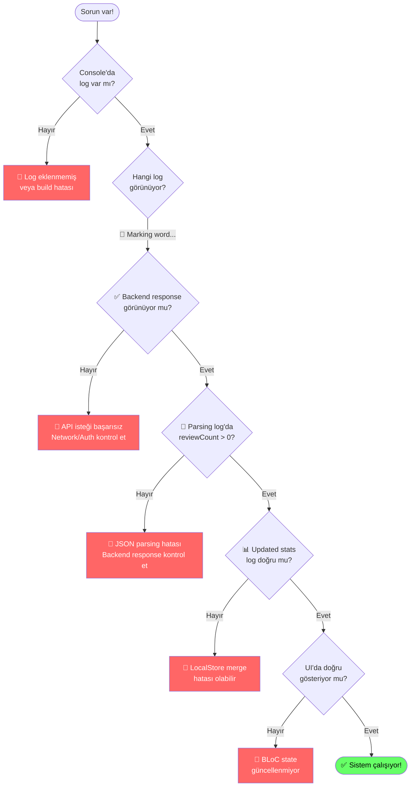
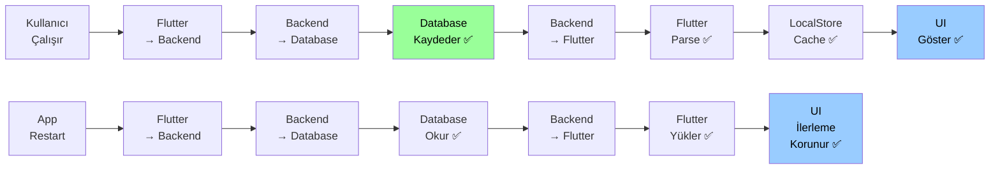

# 📊 Kelime Sistemi - Görsel Akış Şeması

## 🎯 1. Kelime Çalışma Akışı (Review Flow)

---

## 🔄 2. Uygulama Başlatma Akışı (App Launch)

---

## 🐛 3. Bug'lı Durum (ESKİ KOD - DÜZELTİLDİ)

---

## ✅ 4. Düzeltilmiş Durum (YENİ KOD)

---

## 🔍 5. Veri Katmanları (Data Layers)

---

## 🎯 6. Status Progression (İlerleme Basamakları)

---

## 🧪 7. Test Senaryoları

---

## 📊 8. Veri Akışı Özeti

---

## 🔧 9. Debug Points (Hata Ayıklama Noktaları)

---

## 🎯 Özet Akış (High-Level)

---

## 📝 Notlar

### Akış Şemalarını Görüntülemek İçin:

1. **GitHub/GitLab:** Bu markdown dosyasını push edin, otomatik render edilir
2. **VS Code:** "Markdown Preview Mermaid Support" eklentisini yükleyin
3. **Online:** https://mermaid.live adresine gidin ve kodu yapıştırın
4. **Obsidian:** Doğrudan render eder

### Renk Kodları:

- 🟢 Yeşil: Başarılı durum
- 🔴 Kırmızı: Hata/Problem
- 🟡 Sarı: Uyarı/Dikkat
- 🔵 Mavi: Normal akış

### Semboller:

- 📱 Flutter/Mobile
- 🌐 Backend API
- 🗄️ Database
- 🧠 BLoC/State Management
- 💾 Repository/Data Layer
- 📦 Cache/Storage
- 👤 User/Kullanıcı
- ✅ Başarılı
- ❌ Başarısız

